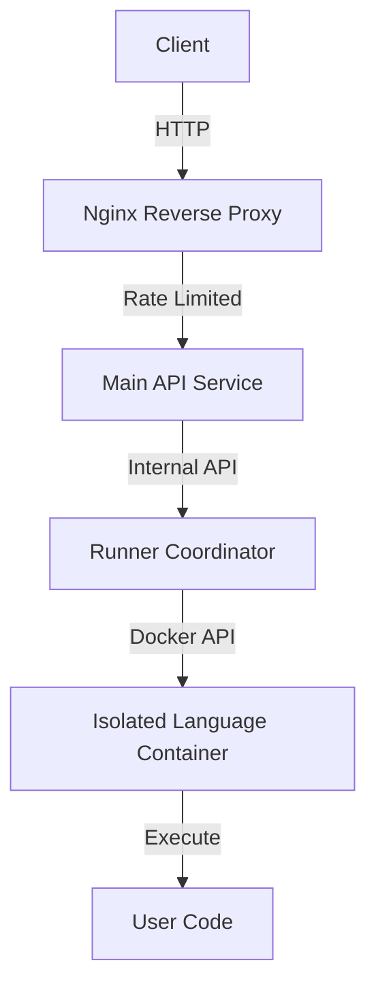

# Secure Code Runner Platform

A high-performance, **Docker‑based, sandboxed online code execution system** designed for competitive programming platforms and online judges. It securely compiles and executes untrusted user code across multiple languages with strict resource isolation and multi-layer security.

---

## 🚀 Key Features

- **Multi-Layer Sandboxing**: Combines Docker isolation, non-root execution, and strict Linux capability dropping.
- **Resource Constraints**: Fine-grained control over CPU (0.5 cores), Memory (128MB-256MB), and PIDs (128 limit).
- **Multi-Language Support**: Optimized runners for C++20, Python 3, Rust, Java, and Node.js.
- **Network Isolation**: Zero network access for user code to prevent data exfiltration.
- **Filesystem Security**: Read-only root filesystem with `tmpfs` mounts for secure execution.
- **Rate Limiting**: Integrated Nginx rate limiting to protect against DoS attacks.

---

## 🧱 Architecture Overview

The system uses a 3-tier architecture to ensure maximum security and scalability:



1.  **Nginx**: Handles SSL termination, load balancing, and strictly enforces rate limits (5-10 req/s).
2.  **Main API (Express.js)**: Orchestrates the workflow, validates inputs, and communicates with the Runner service.
3.  **Runner Service (Docker-in-Docker)**: Manages the lifecycle of volatile execution containers.
4.  **Language Containers**: Minimal, hardened images containing only the necessary compiler/runtime.

---

## 🔐 Security Model

### 1. Docker Runtime Security
Containers are spawned with the following safety flags:
- `--read-only`: Root filesystem is immutable.
- `--network=none`: No internet or local network access.
- `--cap-drop=ALL`: Removes all Linux capabilities.
- `--security-opt=no-new-privileges`: Prevents privilege escalation.
- `--pids-limit=128`: Protection against fork bombs.

### 2. Filesystem Strategy
| Path | Permission | Purpose |
| :--- | :--- | :--- |
| `/` | **Read-Only** | Protects system binaries and libraries. |
| `/app/work` | **Read/Write (noexec)** | Temporary storage for user source code. |
| `/tmp` | **Read/Write (exec)** | `tmpfs` mount for compiled binaries execution. |

---

## 🛠️ Tech Stack

- **Backend**: Node.js, Express.js
- **Infrastructure**: Docker, Docker Compose
- **Reverse Proxy**: Nginx
- **Languages Supported**:
    - **C++**: `g++ 13.x` (C++20)
    - **Python**: `Python 3.12`
    - **Rust**: `rustc 1.75+`
    - **Java**: `OpenJDK 21`
    - **Node.js**: `Node 24`

---

## 🏃 Getting Started

### Prerequisites
- Docker & Docker Compose
- Node.js (for local development)

### Setup & Run
1.  **Clone the repository**:
    ```bash
    git clone https://github.com/MrAdrsMishra/compiler-VM.git
    cd compiler-VM
    ```
2.  **Configure environment**:
    Create a `.env` file in the root:
    ```env
    PORT=3000
    RUNNER_PORT=4000
    CORS_ORIGIN=http://localhost:5173
    RUNNER_URL=http://runner:4000
    RUNNER_REQUEST_TIMEOUT_MS=20000
    ```
3.  **Spin up the infrastructure**:
    ```bash
    docker-compose up --build
    ```

The API will be available at `http://localhost`.

---

## 📡 API Reference

### Run Code
`POST /v1/practice/run-code`

**Request Body:**
```json
{
  "selectedLanguage": "cpp",
  "userCode": "#include <iostream>\nint main() { std::cout << \"Hello World\"; return 0; }",
  "userInput": ""
}
```

**Success Response (Verdict: AC):**
```json
{
  "success": true,
  "verdict": "AC",
  "output": "Hello World",
  "error": null
}
```

**Error Responses:**
- `TLE`: Time Limit Exceeded (10s limit)
- `COMPILE_ERROR`: Compilation failed
- `RUNTIME_ERROR`: Crash or non-zero exit code
- `SYSTEM_ERROR`: Infrastructure failure

---

## ⭐ Author

**Adarsh Mishra**
*Backend & Systems Engineering*

This project is part of the [Placement Engine](https://github.com/MrAdrsMishra) ecosystem.
