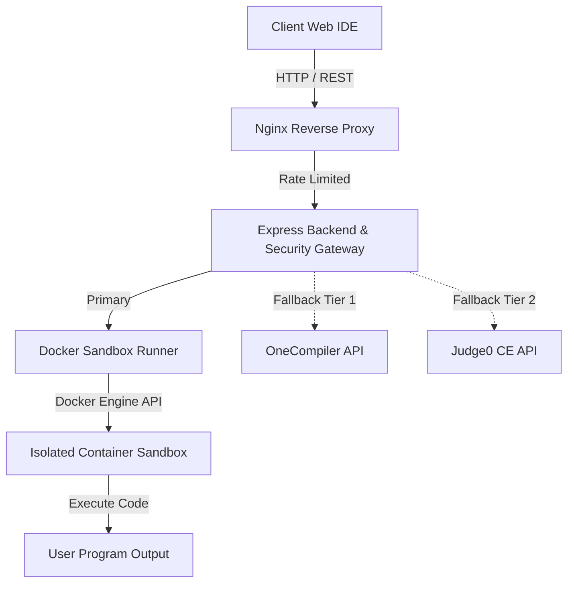

# ⚡ RunMe — Secure Sandboxed Compiler & Online IDE

A high-performance, **Docker-based sandboxed code execution platform & modern web IDE** designed for competitive programming, online judge systems, and developer sandboxes. It securely compiles and executes untrusted user code across 15+ programming languages with strict resource isolation, multi-layer security, and 3-tier execution fallbacks.

---

## 🚀 Key Features

- **🎨 Modern Web IDE ("RunMe")**:
  - **Monaco Editor Integration**: Full code editing powered by VS Code's Monaco engine with syntax highlighting, autocomplete, and find-and-replace support.
  - **Multi-Tab File Workspace**: Instant tab switching across multiple language files (`main.cpp`, `script.py`, `Main.java`, etc.).
  - **Customizable Themes & Layouts**: Toggle between Dracula, Monokai, High Contrast, and GitHub Light themes with custom font sizes, word wrapping, and responsive split view panels.
  - **Console & I/O Metrics**: Live stdout/stderr streaming, execution time tracking, memory usage stats, and custom standard input (`stdin`) testing.
  - **AI Code Assistant**: Embedded assistant tab for instant code explanation, debugging guidance, and complexity analysis.

- **🛡️ Multi-Layer Sandboxing & Isolation**:
  - **Container Isolation**: Non-root execution (`nobody:nogroup`, UID `65534:65534`), `--read-only` root filesystem, and dropped Linux capabilities (`--cap-drop=ALL`).
  - **Network Isolation**: Complete network disconnection (`--network=none`) preventing data exfiltration or socket connections.
  - **Seccomp Syscall Filtering**: Custom JSON seccomp profiles enforcing allowed system call boundaries.
  - **Resource Bounds**: Fine-grained limits per language (CPU cores, 128MB–1024MB RAM, PID limits to defeat fork bombs, output size caps).

- **🔄 3-Tier Resilient Fallback System**:
  1. **Primary**: High-speed Custom Docker Sandbox Containers.
  2. **Tier 1 Fallback**: OneCompiler API.
  3. **Tier 2 Fallback**: Judge0 CE API.
  *Ensures zero downtime even if host Docker containers are undergoing maintenance.*

- **🔐 Security Gateway**:
  - Per-IP rate limiting (sliding window algorithm).
  - Malicious submission scanner guarding against dangerous system calls, shell injection, and path traversal attempts.

- **⚡ Low-Resource / EC2 Ready**:
  - Shared container images (`gcc-runner` for C & C++, `node-runner` for JS & TS) for reduced disk footprint on cloud nodes (e.g. AWS `t3.small`).

---

## 🧱 Architecture Overview


```mermaid
graph TD
    Client[Client Web IDE] -->|HTTP / REST| Nginx[Nginx Reverse Proxy]
    Nginx -->|Rate Limited| Gateway[Express Backend & Security Gateway]
    Gateway -->|Primary| CustomRunner[Docker Sandbox Runner]
    CustomRunner -->|Docker Engine API| Containers[Isolated Container Sandbox]
    Gateway -.->|Fallback Tier 1| OneCompiler[OneCompiler API]
    Gateway -.->|Fallback Tier 2| Judge0[Judge0 CE API]
    Containers -->|Execute Code| UserCode[User Program Output]
```

1. **Client Web IDE**: React 19 SPA running Monaco Editor with live customization & execution state.
2. **Nginx Reverse Proxy**: SSL termination, load balancing, and strict HTTP rate limiting.
3. **Express Backend**: Security gateway enforcing payload validation, per-IP rate limits, and dispatching execution to runner tiers.
4. **Runner Coordinator & Docker Sandbox**: Manages ephemeral container lifecycles, memory samplers, and seccomp profile enforcement.

---

## 🔐 Security Model

### 1. Docker Runtime Flags
Containers are spawned dynamically with non-negotiable security flags:
```bash
docker run --rm \
  --network=none \
  --memory=256m \
  --cpus=1.0 \
  --pids-limit=128 \
  --read-only \
  --cap-drop=ALL \
  --security-opt=no-new-privileges \
  --security-opt=seccomp=/src/security/seccomp-profile.json \
  --user=65534:65534 \
  --tmpfs=/tmp:rw,nosuid,nodev,exec,size=256m \
  -v /tmp/judge-xyz:/app/work:ro \
  mradrsmishra/compiler.com:gcc-runner
```

### 2. Filesystem Access Strategy
| Path | Permission | Description |
| :--- | :--- | :--- |
| `/` | **Read-Only** | Protects system binaries, environment, and container image layers. |
| `/app/work` | **Read-Only Mount** | User source code and `input.txt` mounted safely as read-only. |
| `/tmp` | **Read/Write (`tmpfs`)** | RAM-backed ephemeral filesystem for temporary compilation binaries. |

---

## 🛠️ Tech Stack

- **Frontend (Web IDE)**: React 19, TypeScript, Vite 6, Tailwind CSS v4, `@monaco-editor/react`, Zustand.
- **Backend Service**: Node.js (ES Modules), Express.js, Axios, Dotenv.
- **Infrastructure & Sandboxing**: Docker, Docker Compose, Nginx, Linux cgroups v1/v2, Seccomp profiles.
- **Supported Languages**:
  - **C / C++**: `g++ 13` (C++20)
  - **Python**: `Python 3.12`
  - **Java**: `OpenJDK 21`
  - **JavaScript / TypeScript**: `Node.js 24`
  - **Rust**: `rustc 1.75+`
  - **Go**: `Go 1.22+`
  - **C#**: `.NET SDK 8`
  - **Kotlin, Swift, PHP, Ruby, R, Bash**

---

## 🏃 Getting Started

### Prerequisites
- Node.js (v18+)
- Docker & Docker Compose

### 1. Clone & Setup Repository
```bash
git clone https://github.com/MrAdrsMishra/compiler.git
cd compiler
```

### 2. Environment Configuration
Create a `.env` file in the root directory:
```env
PORT=3000
RUNNER_PORT=4000
CORS_ORIGIN=http://localhost:5173
RUNNER_URL=http://localhost:4000
RUNNER_REQUEST_TIMEOUT_MS=20000
GATEWAY_RATE_LIMIT=30
GATEWAY_RATE_WINDOW_MS=60000
```

### 3. Run Development Environment

**Start Backend Server:**
```bash
npm install
npm run dev
```

**Start Web IDE Frontend:**
```bash
cd IDE
npm install
npm run dev
```
Open `http://localhost:5173` in your browser to launch the Web IDE.

### 4. Docker Compose Production Build
To launch the full stack (Nginx + Backend + Docker Runner):
```bash
docker-compose up --build
```

---

## ⚡ Low-Resource EC2 Deployment Mode

To run efficiently on small cloud instances (e.g. AWS `t3.small` / 2GB RAM):

```env
# Enable shared images (gcc-runner for C/C++, node-runner for JS/TS)
RUNNER_USE_SHARED_IMAGES=1

# Optional: Restrict allowed languages on this node
RUNNER_ALLOWED_LANGS=cpp,python,javascript,java

# Custom image repository tag
RUNNER_IMAGE_REPO=mradrsmishra/compiler.com
```

Build/Publish selected language runners:
```bash
BUILD_LANGS=gcc,node,python npm run images:build
PUBLISH_LANGS=gcc,node,python npm run images:publish
```

---

## 📡 API Reference

### Run Code Endpoint
`POST /practice/run-code`

**Request Body:**
```json
{
  "selectedLanguage": "cpp",
  "userCode": "#include <iostream>\nint main() {\n    std::cout << \"Hello World from RunMe!\";\n    return 0;\n}",
  "userInput": "",
  "fileName": "main.cpp"
}
```

**Success Response (`Verdict: AC`):**
```json
{
  "data": {
    "stdout": "Hello World from RunMe!",
    "stderr": null,
    "compile_output": null,
    "time": "0.04s",
    "memory": 4,
    "service": "custom-runner"
  }
}
```

**Possible Verdicts:**
- `AC` (Accepted / Successful Execution)
- `TLE` (Time Limit Exceeded)
- `COMPILE_ERROR` (Compilation Failure)
- `RUNTIME_ERROR` (Segmentation fault / memory limit / runtime exception)
- `SECURITY_VIOLATION` (Blocked by security gateway)
- `RATE_LIMITED` (Request limit exceeded)

---

## ⭐ Author

**Adarsh Mishra**
- **GitHub**: [@MrAdrsMishra](https://github.com/MrAdrsMishra)
- **Repository**: [https://github.com/MrAdrsMishra/compiler](https://github.com/MrAdrsMishra/compiler)
- **Email**: [adrshmishra020@gmail.com](mailto:adrshmishra020@gmail.com)

